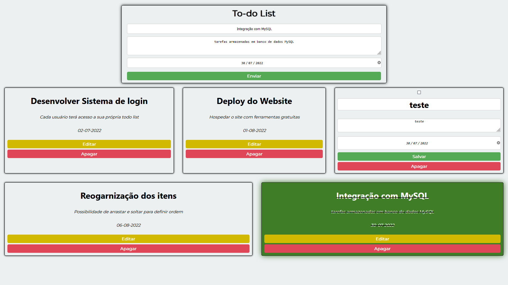

<h1 align="center">
   ToDo List
</h1>

## 
 <u>Preview da página:</u> 

  

> A página possui um front end interativo que permite criar e alterar tarefas"

<h4 align="center"><a href="https://tahaluh-crud-todo-list.netlify.app" target="_blank">Clique para visitar o projeto</a></h4>

---
# 💼 Tecnologias Utilizadas

As seguintes ferramentas foram usadas na construção do projeto:

- Html
- Css
- ReactJS
- NodeJS
- MySQL

*Também foram aplicados conceitos de responsividade*

# ⚙️ Instalação

### Client

  1. `$ cd client`
  2. `$ npm install`
  3. `$ npm start`
  
### Server

  1. Mude o banco de dados mySQL `server/index.js`
  2. `$ cd server`
  3. `$ npm install`
  4. `$ npm rum devStart`

# 🛠️ Funcionalidades

- Criar tarefas no banco de dados
- Ler as tarefas armazenadas no banco de dados
- Atualizar tarefas no banco de dados
- Deletar tarefas do banco de dados

# 🔧 Bibliotecas

### Front-end

- `Axios`
  
### Back-end

- `express`
- `cors`
- `mysql2`
- `nodemon`

---

### Ajustes e melhorias

O projeto ainda está em desenvolvimento e as próximas atualizações serão voltadas nas seguintes tarefas:

- [ ] Sistema de login com "tarefas" relacionadas a conta do usuário
- [x] Deploy do site em ferramentas de hospedagem gratuitas

---

Feito por Thauã Magalhães 👋🏽 Entre em contato!

 

